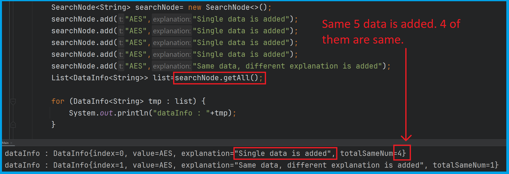
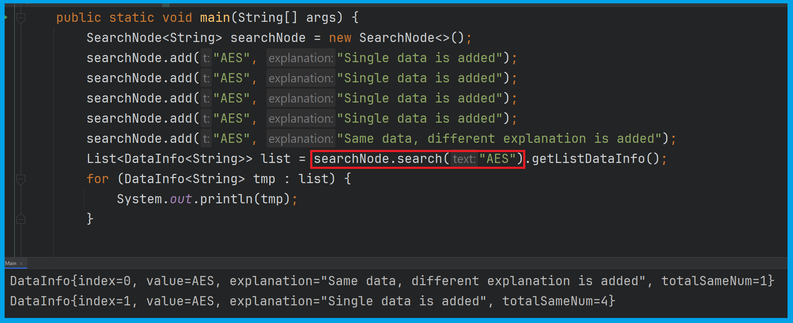
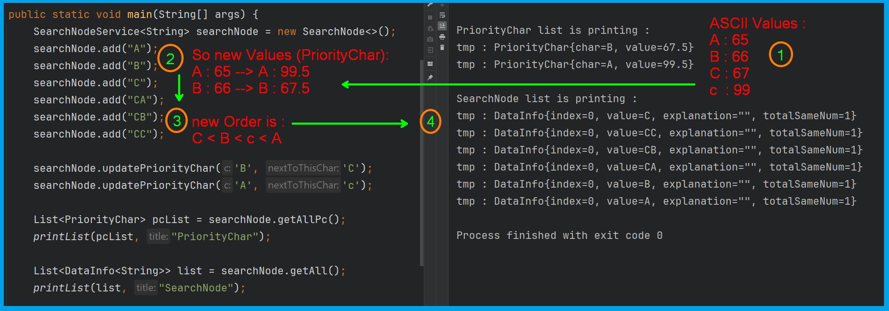
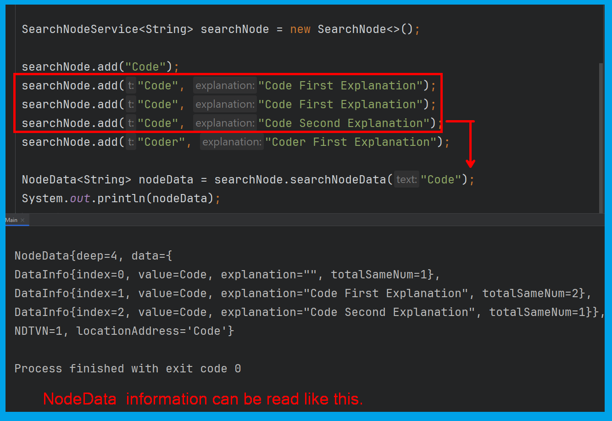

# <i> SearchNode (Graduate Project)</i>

## Content

<ol>
        <a href="#about-project"><li>About The Project</li></a>
        <a href="#why-project-created"><li>Why The Project Was Created?</li></a>
        <a href="#used-technologies"><li>Used Technologies</li></a>
        <a href="#image"><li>Images </li></a>
        </li>
        <a href="#requirements"><li>Requirements</li></a>
         </li>
        <a href="#installation"><li>Installation (Run In IntelliJ IDEA)</li></a>
        <a href="#searchnode-features" ><li> <span style="font-weight:bold;color:red;">SearchNode Library Features</span> </li></a>

<!--         <a href="#version-difference"><li>Version Difference</li></a> -->

</ol>

## <span id="about-project">1-) About The Project</span>

***SearchNode*** is a data structure library in Java programing language. It is similar to Trie data structure.
Besides an ordinary data structure, it has more details on nodes. It stores unique data, but this feature is a bit
different from HashMap.

Another important feature is about sorting. Usually sorting processes depend on alphabets of the speaking languages. This
problem is fixed with the *SearchNode* library. Anything can be sorted in any requested order. Chars should be updated to the requested
order to use this feature by using `updatePriorityChar()` function. Much more detailed can be found in
<a href="#searchnode-features"> <span style="font-weight:bold;color:red">SearchNode Library Features</span> </a>section.

## <span id="why-project-created">2-) Why The Project Was Created?</span >

There were two main purposes. One of them was to create faster searching algorithm than (Arraylist + Merge Sort + Binary
search) combination. The second was to sort data in the requested order, not being addicted to any speaking language.
The SearchNode data structure was planned to be used in the future instead of ArrayList, but so far, both speed and memory
performances are not enough to use it.

It is a kind of mixed ***Trie, Arraylist, and Hashset data structures***.

- Add data and search without using extra custom sort algorithms.
- Get all data sorted in a list.
- Update chars' location in the requested order.
- Decrease code complexity by removing sorting algorithm codes.
- Get unique data and the number of times the same value was added.

(The next version is designed to succeed or at least getting close to the main purpose, but there was no time to do it.)

## <span id="used-technologies">3-) Used Technologies</span>

* Core Technologies:
  * JAVA SE
* Dependencies:
  * org.junit.jupiter.junit-jupiter:RELEASE

## <span id="image">4-) Images </span>

### 1. Add data to SearchNode data structure.

 <br><br>

### 2. Search "AES" data from SearchNode data structure.

 <br><br>

### 4.  PriorityChar - Update Single Char : Sorts in the requested order.

 <br><br>

### 4.  PriorityChar - Update Char List : Sorts in the requested order.

 <br><br>


### 5.  PriorityChar - Update Char List : Sorts in the requested order.

 <br><br>

## <span id="requirements">5-) Requirements</span>

* <a href="https://www.oracle.com/tr/java/technologies/javase/jdk11-archive-downloads.html">JDK 11</a>
* <a href="https://www.jetbrains.com/idea/download/?section=windows"> IntelliJ IDEA (Community Edition) </a>


## <span id="installation">6-) Installation (Run In IntelliJ IDEA)</span>

**1.** Copy and paste the following command in your cmd.

```
git clone https://github.com/AhmetEminSaglik/SearchNode.git
```

**2.**  You can select how to import by following one of the instructors bellow.
  * First option: Adding Jar file as a library:
    1. Add `searchnode-1.0.jar` to your project as a Jar file in `SearchNode` folder.
  
  * Second option: Add Jar file as a Maven dependency:
    1. Copy `org` folder in `maven-setup` to your `.m2\repository`
    2. Add following dependency to your project's `pom.xml`
```xml
<dependency>
    <groupId>org.ahmeteminsaglik</groupId>
    <artifactId>searchnode</artifactId>
    <version>1.0</version>
</dependency>
```

## <span id="searchnode-features"> 7-)<span style="color:red"> SearchNode Library Features</span>

### NOTE : SearchNode data structure was designed to be generic. But for now, it is working correctly only for String values.   

### Concepts
#### <span style="color:cyan"> Priority Char </span>: 

- Is used to change chars standard order of chars. if no priority char is used, it sorts in ASCII order.
If any priority char is used, a new double value is assigned to the char, and that value is used at sorting. 

### 1. Initializing SearchNode 
```java
//for beginner users to SearchNode data structure.
SearchNodeService<String> searchNode = new SearchNode<>();

// for advanced users to SearchNode data structore
SearchNode<String> searchNode = new SearchNode<>();
```
### 2. Adding Data

```java
// 1-) Add only data.
searchNode.add("Code");

// 2-) Add only a data list.
List<String> dataList = new ArrayList<>();
... // fill dataList.
searchNode.addAll(dataList);

// 3-) First parameter is data, second parameter is explanation.
searchNode.add("Code","Code First Explanation");

// 4-) First parameter is data, second parameter is explanation list.
List<String> explanationList = new ArrayList<>();
... // fill explanationList.
searchNode.add("Code", explanationList);
```

### 3. Read Data

```java
// A-)  Search Data
    // 1-) get NodeDataService
NodeDataService<String> nds= searchNode.search("AES");
        
        // returns node's depth value.
        nds.getDeep(); // 3
        
        // returns node's location address.
        nds.getLocationAddress(); // AES
        
        // return next directions total data value.
        nds.getNextDirectionsTotalValueNumber(); // if any data is added starts with AES than this value will be changed 

    // 2-) get DataInfo value. This list size change according to different explanation values.
DataInfo<String> dataInfo=nds.getListDataInfo().get(0);

       // returns added data index no for located Node.        
       dataInfo.getIndex(); // 0

       // returns added data        
       dataInfo.getValue(); // AES

       // returns added explanation        
       dataInfo.getExplanation(); // explanation was not added. So this function will return empty String "" 

       // returns added total same data and explanation value.        
       dataInfo.getTotalSameNum(); // 1
```

```java
// returns all data in the requested order.
searchNode.getAll();

// return all data in the reversed order.
searchNode.getAllReverse();

// return all PriorityChar list.
searchNode.getAllPc();

// returns all starting data with "AES".
searchNode.getAllStartWith("AES");

// returns next char of 'c'. This is completely changeable to PriorityChar.
searchNode.getNextPc('c');

// returns total size of added data.
searchNode.getTotalItemNumber(); 
```

### 4. Update Data

```java
// first parameter is data, second parameter is old explanation, third parameter is new explanation
searchNode.update("data","old explanation", "new explanation");

// first parameter is data, second parameter is new explanation List. If empty explanation is found, updates it. Otherwise, create a new explanations with the same data.
List<String> explanationlist= new ArrayList<>();
... // add explanationList
searchNode.update("data", explanationList);

// first parameter is data, second parameter is old explanation, third parameter is new explanation List.
List<String> explanationlist= new ArrayList<>();
... // add explanationList
searchNode.update("data","old explanation", explanationList);

//first parameter is the char that will be updated next to second parameter char.
searchNode.updatePriorityChar('b','y'); // order : a,c....y,b,z

//first parameter is the char list that will be updated next to second parameter char.
List<Character> charList= new ArrayList<>();
... // fill charList.
//let's say charList is d,b,c
searchNode.updatePriorityChar(charList,'y'); // then order will be : a,e,...y,d,b,c,z
```

### 5. Delete Data

```java
// delete priorityChar value for the given char. Which means ASCII code's value will be used for this char.
searchNode.resetPriorityChar('c');

// deletes all priorityChars. Which means ASCII codes' values will be used for whole chars.
searchNode.resetAllPriorityChars(); // 

// delete AES data. And deletes all explanation in it.
searchNode.remove("AES");

//deletes given list data
List<String> dataList = new Arraylist<>();
...// add data to list;
searchNode.removeAll(dataList); 
```

